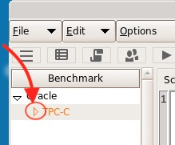
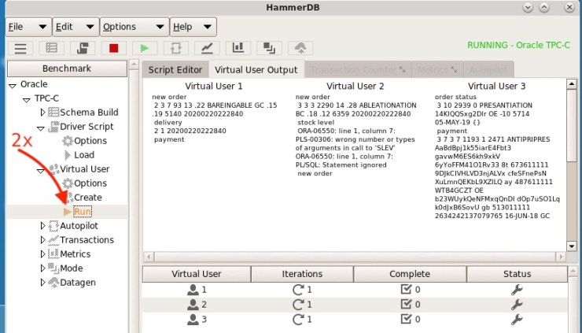
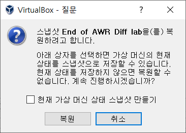
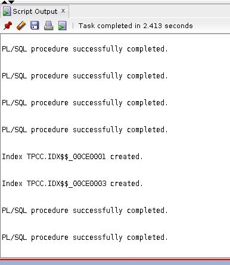
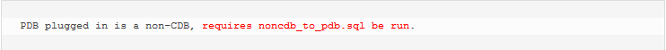
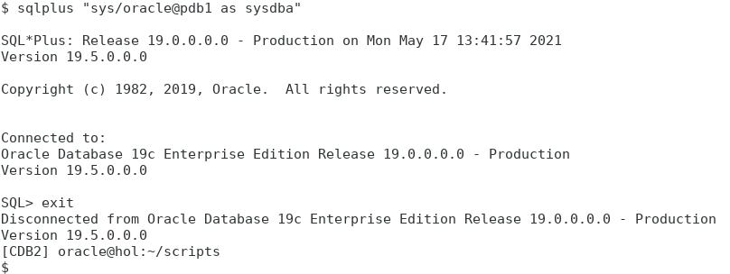

19c Upgrade Hands-On Lab
========================

19c Upgrade Exercises
=====================

   
   

Oracle Korea

Solution Engineering

May 2021

Ver 2.0

---

## 목차  
[HOL 1. AutoUpgrade Ⅰ](#hol-1-autoupgrade-ⅰ)  

[HOL 2. AWR Diff Report](#hol-2-awr-diff-report)  

[HOL 3. SQL Perfomance Analyzer(SPA)](#hol-3-sql-perfomance-analyzerspa)  

[HOL 4. SQL Plan Management(SPM)](#hol-4-sql-plan-managementspm)  

[HOL 5. SQL Tuning Advisor](#hol-5-sql-tuning-advisor)    

[HOL 6. Plugin UPGR into CDB2](#hol-6-plugin-upgr-into-cdb2)  

[HOL 7. Migrate/Upgrade FTEX to PDB2](#hol-7-migrateupgrade-ftex-to-pdb2)  

[HOL 8. Upgrade Multitenant DB](#hol-8-upgrade-multitenant-db)  

[HOL 9. AutoUpgrade Ⅱ](#hol-9-autoupgrade-ⅱ)  

 

[Appendix](#appendix)   
  
    

 ---

## HOL 실습 동영상 유튜브 링크

HOL 1 유튜브 링크  
   
HOL 2 유튜브 링크  
  
HOL 3 유튜브 링크  
  
HOL 4 유튜브 링크  
  
HOL 5 유튜브 링크  
  
HOL 6 유튜브 링크  
  
HOL 7 유튜브 링크  
  
HOL 8 유튜브 링크  
  
HOL 9 유튜브 링크  
 

---
 

## HOL 1. AutoUpgrade Ⅰ

AutoUpgrade Utility는 Oracle Database Upgrade 작업과 관련한 모든 과정을
자동화 시킨 오라클 유틸리티로서, DBA 및 작업자의 개입을 최소화하여
Upgrade 작업 효율성을 증가시키고, 다수의 DB에 대한 Upgrade 작업 편의성을
극대화 시킨 Java 기반의 Oracle Upgrade Utility 프로그램입니다.

교육 참여자는 본 실습을 통해 11gR2(11.2.0.4) Database를 19c 버전으로,
AutoUpgrade Utility를 사용해 손쉽게 Upgrade 할 수 있는 방법을 실습할 수
있습니다. 또한, 이어지는 다음 실습에서 19c로의 DB Upgrade 후 SQL 성능과
관련한 다양한 성능비교 방법과 SQL 성능 안정화 방법을 습득할 수 있습니다.

**\[1\] Application Workload
생성** 

19c로의 AutoUpgrade를 실습하기 전에 우선, Upgrade 전과 후의 SQL 및 DB
성능을 비교하기 위한 가상의 Application Workload를 HammerDB 툴로 11gR2
DB에 생성하고, 관련된 성능 데이터를 수집합니다.

1.  VBox에서 Terminal 프로그램 실행

2.  oracle 유저에서 11g DB (UPGR) 환경으로 전환 및 접속

-   **접속한 SQL Plus 창은 닫지 말고, 아래 18번 단계까지 계속 사용하시기
    바랍니다.**

> $ . upgr
>
> $ cd /home/oracle/scripts  
> $ sqlplus / as sysdba

3.  11g DB (UPGR) AWR Snapshot 생성 및 **생성된 Snapshot 번호 확인**

4.  HammerDB 기동

5.  TPC-C 클릭  
 :

6.  Driver Script 클릭  

7.  Load 옵션 **더블 클릭**  

8.  Driver Script 내용 확인 (에러 내용 무시)  

9.  Virtual User 클릭  

10. Create **더블 클릭** (생성되어 있는 3명의 가상 유저 확인)  

11. Cursor Cache로부터 SQL 캡처 시작  

-   이 SQL 스크립트는 10초 간격으로 240초 동안 자동으로 실행되며, 그
    동안 HammerDB에 의해 발생하는 모든 SQL들을 Cursor Cache로부터 직접
    수집하게 됩니다.

12. HammerDB의 ‘**Run’** **더블 클릭**

-   시작된 TPC-C 부하를 확인하고 모니터링 합니다.

13. Graph / Transaction Counter 아이콘 클릭

14. TPC-C 부하 상태 모니터링 (부하는 약 2분\~3분 동안 지속됩니다.)  

15. HammerDB 실행 중, AWR Snapshot 생성

-   14번과 같이 HammerDB에 의해 부하가 발생되는 것이 확인되면, AWR 정보
    저장을 위해 Snapshot을 한 번 생성합니다.

(1)  ‘New Tab’으로 새로운 터미널 창 오픈

> 

(2)  11g DB 환경으로 전환하고, Snapshot 생성 후 SQL Plus 종료

> $ . upgr
>
> $ cd /home/oracle/scripts
>
> $ sqlplus / as sysdba
>
> SQL> **@/home/oracle/scripts/snap.sql**
>
> SQL> exit

16. 부하 종료 확인  

17. HammerDB 종료  

18. 부하 종료 후, AWR Snapshot 생성 및 **생성된 Snapshot 번호 확인**

-   **아래와 같이, 반드시 앞서 11번에서 실행한 capture_cc.sql의 실행이
    종료된 것을 확인하고 Snapshot을 캡처 하시기 바랍니다.)  
    **

Snaphost 생성 및 **Snapshot 번호 확인**  

19. 생성된 AWR로부터 SQL 수집  

20. SQL Plus 종료

**\[2\] AutoUpgrade**

Oracle AutoUpgrade 유틸리티를 사용하여, 현재 VBox 상에 11g인 UPGR DB를
19c UPGR DB로 업그레이드 시킵니다. AutoUpgrade 유틸리티는 VBox
실습환경의 19c DB에 Default로 설치되어 있는 ‘autoupgrade.jar’을
사용합니다. ( $OH19/rdbms/admin/autoupgrade.jar )

1.  oracle 유저에서 11g DB환경으로 전환 및 sample configuration 파일
    생성

> $ . upgr
>
> $ cd /home/oracle/scripts  
> $ java -jar $OH19/rdbms/admin/autoupgrade.jar -create_sample_file
> **config**

-   sample_config.cfg 파일이 위 명령어를 실행한 /home/oracle/scripts에
    생성됩니다.

2.  sample_config.cfg 파일 내용 편집

-   vi 편집기로 Sample 파일을 열어, 아래 **Bold된 내용대로 일부 항목을
    수정/추가**합니다.

> $ **vi /home/oracle/scripts/sample_config.cfg**
>
> #Global configurations
>
> #Autoupgrade's global directory, ...
>
> #temp files created and other ...
>
> #send here
>
> global.autoupg_log_dir=**/home/oracle/upg_logs**
>
>
> upg1.dbname=**UPGR**
>
> upg1.start_time=NOW
>
> upg1.source_home=**/u01/app/oracle/product/11.2.0.4**
>
> upg1.target_home=**/u01/app/oracle/product/19**
>
> upg1.sid=**UPGR**
>
> upg1.log_dir=**/home/oracle/logs**
>
> upg1.upgrade_node=**localhost**
>
> upg1.target_version=19
>
> **upg1.restoration=no 추가해야 되는 파라미터**

3.  sample_config.cfg 파일명 변경

> $ **mv** /home/oracle/scripts/**sample_config.cfg**
> /home/oracle/scripts/**UPGR.cfg**

4.  AutoUpgrade 시작 전, Upgrade 환경 분석  
    (아래 명령어는 한 줄 명령어입니다.)

> $ **java** -jar $OH19/rdbms/admin/autoupgrade.jar -config
> /home/oracle/scripts/UPGR.cfg **-mode analyze**

-   위 명령어를 실행하면, 터미널 창은 SQL Plus와 형태가 비슷한
    AutoUpgrade 실행 환경(UPG Job Console)으로 전환되어 ‘**upg>**’
    프롬프트가 표시됩니다.

5.  UPG Job Console에서 앞에서 실행한 Analyze 상태 확인

> upg> **lsj** 앞서 실행한 Analye **Job 번호 확인**
>
> upg> **status -job 잡번호** **확인된 Job 번호**로 analyze 상태 확인

6.  Analyze 작업 완료 확인

-   Analyze 작업이 완료되면, 위와 같은 메시지가 자동 출력되어 결과를
    확인할 수 있고, **‘UPG Job Console’은 자동 종료**됩니다.

7.  AutoUpgrade 실행  
    (아래 명령어는 한 줄 명령어입니다.)

> $ **java** -jar $OH19/rdbms/admin/autoupgrade.jar -config
> /home/oracle/scripts/UPGR.cfg **-mode deploy**

-   위 명령어를 실행하면, 터미널 창은 SQL Plus와 형태가 비슷한
    AutoUpgrade 실행 환경(UPG Job Console)으로 전환되어 ‘**upg>**’
    프롬프트가 표시됩니다.

-   VBox에서의 AutoUpgrade는 사용자 PC 성능에 따라 25분\~40분 정도
    진행됩니다.

8.  AutoUpgrade 실행 상태 모니터링

> upg> **help** 다양한 UPG Job Console 명령어 확인
>
> upg> **lsj** 앞서 실행한 AutoUpgrade Deploy **Job 번호 확인**
>
> upg> **status -job 잡번호** **확인된 Job 번호**로 analyze 상태 확인

9.  AutoUpgrade 실행 중, 각종 Log 확인

> upg> **logs** Log 위치 확인

(1)  새로운 터미널 창 오픈

(2)  Preupgrade Check 내용 확인

> $ cd /home/oracle/logs/UPGR/잡번호/prechecks
>
> $ firefox **upgr_preupgrade.html** &

잠시 기다리면 Firefox 브라우저가 실행되고 관련 내용을 확인 할 수
있습니다.

(3)  Upgrade 진행 상태 확인

> $ cd ../dbupgrade
>
> $ tail -f **catupgrd\*0.log**

10. 웹브라우저를 활용한 AutoUpgrade 실시간 모니터링

> $ cd /home/oracle/upg_logs/cfgtoollogs/upgrade/auto
>
> $ python -m SimpleHTTPServer 8000

-   AutoUpgrade를 실행한 후
    ‘/home/oracle/upg_logs/cfgtoollogs/upgrade/auto’ 디렉 토리로
    이동하면 state.html 파일이 생성되어 있음을 확인할 수 있고, 이 파일에
    업그 레이드 진행 내용이 계속 업데이트 되는 것을 알 수 있습니다. 위와
    같은 파이썬 명령어로 간단히 파이썬웹서버를 8000번 포트로 기동시키면
    state.html에 업데이트되는 내용을 손쉽게 웹브라우저를 통해 실시간
    모니터링 할 수 있습니다.

-   VBox의 Firefox 웹브라저를 실행한 후, URL에 아래와 같이 입력하면,
    업그레이드 상태를 실시간 모니터링 할 수 있습니다.

> **http://localhost:8000/state.html**

11. AutoUpgrade 완료 확인

-   AutoUpgrade 작업이 정상적으로 완료되면, 위와 같은 메시지가 출력되어
    Upgrade 결과를 확인할 수 있고, **‘UPG Job Console’은 자동
    종료**됩니다.

-   AutoUpgrade 진행 중, 11g DB는 자동 종료되고, AutoUpgrade가 완료되면
    19c DB가 자동 기동되어 있습니다.

12. DB 19c 접속 및 Upgrade 결과 확인

> $ . upgr19 19c UPGR DB환경으로 전환
>
> $ sqlplus / as sysdba 19c UPGR DB 접속
>
> SQL> select instance_name, version_full, status from v$instance;
>
> SQL> exit

---

## HOL 2. AWR Diff Report

업그레이드, 패치, 파라미터 변경 등의 Database 환경에 변화가 있을 때 변경
전후의 Database 성능을 측정할 필요가 있습니다. 이와 같은 상황에서 DB가
업그레이드로 성능이 개선되었는지, TPS는 어떻게 변경되었는지, Wait
Event는 줄어들었는지, SQL 성능은 더 빨라졌는지 손쉽게 비교할 수 있는
Oracle Report가 AWR Diff입니다.

이전 업그레이드 전 시나리오에서 HammerDB로 실행한 SQL들을 업그레이이드
후에 한번더 실행하여 비교합니다. 이번 실습 시나리오는 다음과 같습니다.

1.  19c로 업그레이드된 DB에 접속

2.  HammerDB 실행 전 AWR snap 생성

3.  HammerDB로 SQL들을 실행

4.  HammerDB 실행 후 AWR snap 생성

5.  위에서 생성한 snap_id 두개와 업그레이드 전 기록해둔 snap id 두개를
    이용하여 AWR Diff Report 생성

6.  AWR diff Report를 분석하여 업그레이드 전후 성능 비교

**\[1\] 실습환경 준비**

우선 19c로 접속하여 실습을 준비합니다.

-   Oracle 계정에서 19c로 업그레이드 된 DB 환경으로 변경 후 DB 접속

> $ . upgr19  
> $ cd /home/oracle/scripts  
> $ sqlplus / as sysdba

**\[2\] HammerDB 실행전 AWR
Snapshot 생성**

이번 단계에서는 부하 생성전에 AWR Snapshot을 생성합니다.

-   Snapshot 생성 스크립트 실행

> @/home/oracle/scripts/snap.sql

수행 결과는 터미널에서 바로 확인 할 수 있으며, 나중에 AWR Report를
생성할 때 사용할 수 있도록 **생성된 Snap id를 메모장에 기록**해 두시기
바랍니다.

**\[3\] HammerDB로 부하 생성**

이번 단계에서는 업그레이드 전후 DB 성능을 비교하기위해 업그레이드 이전
단계에서 이미 실행한 HammerDB를 다시 한 번 더 실행합니다.

1.  해머 DB 아이콘 더블 클릭

2.  TPC-C 삼각형 부분 클릭

3.  드라이버 스크립트 부분의 삼각형 클릭

4.  LOAD **더블 클릭**

5.  버추얼 유저 삼각형 부분 클릭

6.  Create **더블 클릭**

7.  **‘Run’** **더블 클릭으로 HammerDB 부하 생성 시작**

8.  그래프 버튼 클릭 및 부하 상태 확인

9.  HammerDB 실행 중, AWR Snapshot 생성

위의 그림과 같이 HammerDB에 의해 부하가 발생되는 것이 확인되면, AWR 정보
저장을 위해 **Snapshot을 한번 더 생성**합니다

> @/home/oracle/scripts/snap.sql

10. HammerDB 부하생성 종료 확인

-   위 그림처럼 부하 생성 작업의 완료는 그래프 아래부분의 Status에
     초록색 체크표시가 3개 생기고, 우측상단에 COMPLETE 메시지가
     출력되는 것으로 확인할 수 있습니다.  
     (시간은 2\~3분 정도 걸림)

**\[4\] HammerDB 종료 후 AWR
Snapshot 생성**

이번 단계에서는 SQL 실행이 모두 끝난 후 AWR의 snap id를 생성합니다.

1.  Snap id를 생성하는 스크립트 실행

> @/home/oracle/scripts/snap.sql

2.  Snap id를 생성하는 스크립트를 한번 더 실행

> @/home/oracle/scripts/snap.sql

방금 생성한 두번째 Snapshot id를 **메모장에 기록**해 둡니다.

**\[5\] AWR Diff Report 생성**

1.  AWR Diff Report를 생성하는 스크립트 실행

> @?/rdbms/admin/awrddrpt.sql
>
> 

2.  파라미터 없이 엔터 입력 후, num_days에는 숫자 2 입력

> 

3.  업그레이드 이전의 첫번째 Snapshot id 입력 후 엔터  
    (아래 예에서는 127을 입력했으나 실습자 환경에서는 숫자가 다를 수
    있습니다.)

> 

4.  업그레이드 이전의 마자막 snap_id 입력 후 엔터  
    (아래 예에서는 129를 입력했으나 실습자 환경에서는 숫자가 다를 수
    있습니다.)

> 

5.  num_days2 에는 숫자 2 입력

> 

6.  업그레이드 후 첫번째 snap_id 입력  
    (아래 예에서는 132을 입력했으나 실습자 환경에서는 숫자가 다를 수
    있습니다.)

> 

7.  업그레이드 후 마지막 snap_id 입력  
    (아래 예에서는 134를 입력했으나 실습자 환경에서는 숫자가 다를 수
    있습니다.)

> 

8.  리포트명을 awrdiff 로 입력 후 엔터

9.  생성된 리포트 확인을 위해 SQL Plus 종료

> exit

10. 터미널에서 Firefox를 실행시켜 생성한 AWR Diff Report 내용 확인

> firefox /home/oracle/scripts/awrdiff\*.html &

**\[6\] AWR diff Report를
분석하여 업그레이드 전후 성능 비교**

AWR Diff 보고서의 Load Profile, Top Timed Events, Top SQL 등을 분석하여
업그레이이드 전후의 DB 성능을 비교합니다.

1.  Upgrade 전후의 전체 Database 부하 비교

2.  Upgrade 전후의 Wait Event 비교

3.  Upgrade 전후의 SQL 수행시간 및 I/O Time 비교

4.  현재실습 VBox 스냅샵 저장

> 추후 목차 ‘HOL 5’ 단계에서 SQL Plan Base Line이 없는 깨끗한 환경으로
> SQL Tuning Advisor 실습을 진행하기 위해 Virtual Box의 Snapshot 기능을
> 사용하여 현재 VBox Database 상태를 저장 합니다.
>
> 
>
> 스냅샷 이름에 ‘End of AWR Diff Lab’ 를 입력하고 확인을 누릅니다.
>
> 

이로써 AWR Diff Report를 이용한 업그레이드 전/후 DB 성능 분석을
종료합니다. 오라클에서는 AWR 보고서를 기반으로, DB 업그레이드 전/후
성능을 사용자가 편리하게 비교할 수 있는 기능을 제공하고 있으며, 사용자는
이를 통해 DB 업그레이드 후 다양한 DB 성능상의 차이점을 빠르게 확인하고
검증 할 수 있습니다.

---

## HOL 3. SQL Perfomance Analyzer(SPA)

앞 단계 실습에서 AWR Diff Report로 업그레이드 전후의 전체적인 Database
성능정보를 분석하였다면, 이번 단계 실습에서는 SPA를 이용해서 SQL 레벨의
Elapsed Time, CPU Time, 실행계획등을 상세하게 비교하는 실습을
진행합니다. SPA는 Database RAT(Real Application Testing) 옵션의
일부분입니다. 본 실습에서는 앞서 업그레이드 전 실습에서 생성한 SQL
Tuning Set 2개를 사용합니다.

시나리오는 다음과 같습니다.

1.  19c DB에 접속

2.  이미 생성된 SQL Tuning Set 확인

3.  SPA 명령어 실행

4.  SPA Report 분석

5.  옵티마이저 파라미터를 11g로 수정하여 SPA 다시 실행

**\[1\] 실습환경 준비**

먼저 단계에서는 19c로 접속하여 실습을 준비합니다.

-   19c로 업그레이드 된 DB 환경으로 전환 후 SQL Plus로 19c DB에 접속

> $ . upgr19  
> $ cd /home/oracle/scripts  
> $ sqlplus / as sysdba

**\[2\] 이미 생성된 SQL
Tuning Set 확인**

이번 단계에서는 SPA 리포트에서 사용될 SQL Tuning Set을 확인합니다.

-   앞서 생성한 SQL Tuning Set 확인

> select count(\*), sqlset_name from dba_sqlset_statements group by
> sqlset_name order by 2;

**\[3\] SPA 실행**

이번 단계에서 실행하는 SPA 명령어에는 아래와 같은 작업내용이 포함됩니다.

-   STS_CaptureAWR를 SPA에서 사용할 수 있는 포맷으로 변환합니다.

-   STS_CaptureAWR의 모든 SQL을 시뮬레이션 합니다.

-   업그레이드 전후의 SQL 성능정보를 비교합니다.

-   SPA 보고서를 출력합니다. 이번 실습에서는 CPU Time과 Elapsed Time
     메트릭을 기준으로 보고서가 생성됩니다. 아래 URL에 접속하면 더
     다양한 SPA관련 메트릭들을 확인할 수 있습니다.

> https://mikedietrichde.com/2015/09/09/different-metrics-for-spa-sql-performance-analyzer/

1.  CPU_TIME 메트릭을 기반으로 시뮬레이션

> @/home/oracle/scripts/spa_cpu.sql

2.  시뮬래이션 결과를 HTML Report로 생성

> @/home/oracle/scripts/spa_report_cpu.sql

3.  Elapsed_TIME 메트릭을 기반으로 시뮬레이션

> @/home/oracle/scripts/spa_elapsed.sql

4.  시뮬래이션 결과를 HTML Report로 생성하고 SQL Plus 종료

> @/home/oracle/scripts/spa_report_elapsed.sql
>
> exit

5.  터머널에서 Firefox 브라우저를 사용해 생성된 Report 내용 확인

> $ cd /home/oracle/scripts
>
> $ firefox compare_spa\_\* &

**\[4\] SPA Report 분석**

앞 단계에서 두가지(CPU_TIME, Elapsed TIME) 형태의 SPA Report를
생성했습니다. 각각의 보고서에는 SQL의 성능이 전체적으로 얼마나
향상되었는지, 개별 SQL 중에서 성능이 느려진 SQL은 없는지, 개선 비율은
얼마인지 등을 분석한 내용이 기록되어 있습니다.

**\[5\] 옵티마이저를 11g로
수정하여 SPA 재실행**

이번 단계에서는 19c DB의 옵티마이저 파라미터를 버전 11.2.0.4로 수정해,
19c가 아닌 11g 옵티마이저 기능을 사용하도록 변경시켜 SPA를 실행합니다.
이렇게 하면 19c로의 업그레이드에 따른 SQL 성능향상 효과를 볼 수 없기
때문에, 실제 운영환경에서의 이와 같은 작업은 특별한 상황이 아니라면 절대
권고하지 않습니다.

1.  옵티마이저 파라미터를 11g로 변경 후, Elapsed_TIME 메트릭을 기반으로
    SPA 실행

> $ sqlplus / as sysdba
>
> SQL> alter session set optimizer_features_enable=’11.2.0.4′;
>
> SQL> @/home/oracle/scripts/spa_elapsed.sql

2.  실행 결과를 HTML Report로 생성하고 SQL Plus 종료

> SQL> @/home/oracle/scripts/spa_report_elapsed.sql
>
> SQL> exit

3.  생성된 SPA 보고서 내용을 Firefox 브라우저로 확인

> cd /home/oracle/scripts
>
> firefox compare_spa\_\* &

 위와 같이, 기본적으로는 19c Database 환경을 사용하게 됨으로 여전히 SQL
 성능개선은 있지만, 실행계획은 11g Database 환경에서 사용하던 것을
 그대로 사용하고 있습니다. 따라서 19c 옵티마이저에 최저화된 Plan에 따른
 더 나은 SQL 성능 향상은 없습니다.

 이번 실습에서 확인한 것과 같이 사용자는 Oracle SPA를 사용하여, Upgrade
 전/후 운영 SQL의 성능을 세밀하게 분석할 수 있고, 이를 통해 사전에
 성능저하가 발생할 수 있는 SQL을 찾아내 보완할 수 있으므로, 실제
 Upgrade 이후 악성 SQL의 발생이나 예기치 못한 SQL 성능저하 문제를 미리
 예방할 수 있습니다.

---

## HOL 4. SQL Plan Management(SPM)

이전 실습에서 SPA를 이용하여 성능이 저하된 SQL을 찾았다면, 이번
실습에서는 업그레이드로 실행계획이 변경되어 성능이 저하된 SQL의 Plan을
성능이 우월한 Plan으로 고정 시키는 방법에 대해 실습합니다. 이번
실습에서는 Oracle SPM 기능을 활용합니다.

실습 시나리오는 다음과 같습니다.

1.  19c DB에 접속

2.  SQL PLAN BASELINE 생성하여 개별 SQL PLAN 고정

3.  SPM을 이용하여 모든 SQL의 실행계획을 11g로 고정

4.  SPA 실행 및 Report 분석

**\[1\] 실습환경 준비**

19c DB 환경으로 접속하여 실습을 준비합니다.

-   19c로 업그레이드 된 DB 환경으로 전환 후 19c DB에 접속

> $ . upgr19  
> $ cd /home/oracle/scripts  
> $ sqlplus / as sysdba

**\[2\] SQL PLAN BASELINE
생성 및 개별 SQL PLAN 고정**

이번 단계에서는 업그레이드 전후에 실행계획이 달라진 특정 SQL에 대해 SQL
Plan Baseline을 생성하여 기존 Plan이 변경되지 않도록 작업합니다.

1.  SPM 스크립트 실행

> @/home/oracle/scripts/spb_create.sql

2.  SQL ID에 ‘7m5h0wf6stq0q’를 입력하고 엔터

3.  성능이 우월한 PLAN인 **107582607** 을 1ST 실행계획으로 입력  
    

4.  엔터 3번 입력

5.  생성된 SQL Plan Baseline 확인

> SELECT sql_handle, plan_name, enabled, accepted FROM
> dba_sql_plan_baselines;

-   ENABLED = Y 이고 ACCEPTED = Y 임으로 앞으로 해당 SQL의 PLAN은
     변경되지 않고 고정됩니다.

**\[3\] SPM으로 모든 SQL의
실행계획을 11g로 고정**

이번 단계에서는 SQL 튜닝 세트 STS_CaptureCursorCache의 모든 SQL을 11g
DB에서 사용하던 Plan으로 고정시킵니다. 19c로의 업그레이드 성능개선
효과를 볼 수 없음으로 실제 운영환경에 대해서는 이와 같은 작업을 권고하지
않습니다.

1.  SQL 튜닝 세트의 모든 SQL PLAN을 11g로 고정

> @/home/oracle/scripts/spm_load_all.sql

2.  생성된 모든 SQL PLAN BASELINE 확인

> SELECT sql_handle, plan_name, enabled, accepted FROM
> dba_sql_plan_baselines;

-   모든 SQL의 PLAN이 업그레이드 이전으로 고정되었습니다.

**\[4\] SPA 실행 및 Report
분석**

> 이제 고정된 PLAN으로 SPA를 실행하고 보고서를 출력하여 분석합니다.

1.  CPU_Time과 Elapsed_TIME 메트릭을 사용하여 시뮬레이션 후 html 리포트
    생성

> @/home/oracle/scripts/spa_cpu.sql
>
> @/home/oracle/scripts/spa_report_cpu.sql
>
> @/home/oracle/scripts/spa_elapsed.sql
>
> @/home/oracle/scripts/spa_report_elapsed.sql
>
> exit

2.  터머널에서 CPU_TIME과 Elapsed_TIME 두가지 보고서 내용을 Firefox로
    확인

> cd /home/oracle/scripts
>
> firefox compare_spa\_\* &

-   위와 같이 Database 내부적으로 실행계획을 업그레이드 전으로 되돌릴
    수는 있지만, 대부분의 SQL들의 성능이 저하될 수 있습니다. 위의 예에서
    성능이 개선된 SQL은 2개 뿐입니다. 따라서 모든 SQL의 PLAN을 이전
    버전으로 고정 시키기 보다는 성능이 저하된 개별 SQL에 대해서만 SQL
    PLAN BASLINE을 생성하여 활용하는 것을 권고합니다.

-   만약 성능이 저하된 SQL이 발견된다면 아래처럼 Regression Impact와
    Regressed SQL 의 개수가 나타납니다.

> 

-   이런 경우 위의 5개 SQL에 대해서만 SQL PLAN BASELINE을 생성하면
     됩니다.

---

## HOL 5. SQL Tuning Advisor

이전 실습에서 SPM을 이용하여 실행계획이 여러개 일때 최적의 실행계획으로
고정시키는 실습을 하였다면, 이번 실습에서는 SQL Tuning Advisor를
이용하여 SQL 성능을 개선시키는 방법에 대해 실습합니다. 19c DB로
업그레이드 후 SPA로 성능이 느려진 SQL을 찾은 뒤, 이번 단계에서 실습하는
SQL Tuning Advisor 기능을 이용하여 19c에서 느려진 SQL 성능을 손쉽게
개선시킬 수 있습니다.

실습 시나리오는 다음과 같습니다.

1.  19c DB에 접속

2.  SQL Tuning Task를 만들고 SQL Tuning Advisor로 해당 SQL Task를
    시뮬레이션

3.  성능개선 권고안 기능 실행

4.  SPA를 실행 및 결과 Report 분석

**\[1\] 실습환경 준비**

지금까지 실습했던 VBox를 종료하고 SQL Plan Base Line이 없는 깨끗한
환경에서 실습하기 위해 앞서 저장한 스냅샷 ‘End of AWR Diff Lab’을
복원합니다.

현재 가상머신 상태 스냅샷 만들기는 체크하지 않고 복원 버튼을 누릅니다.

복원이 되었으면 현재상태에서 시작버튼을 눌러 서버를 구동 시킵니다.

VBox 서버가 구동되었으면 터미널을 열고 19c DB 환경으로 전환 후 19c DB에
접속합니다.

-   19c로 업그레이드 된 DB에 접속

> $ . upgr19  
> $ cd /home/oracle/scripts  
> $ sqlplus / as sysdba

**\[2\] SQL Tuning Task 생성
및 시뮬레이션**

이번 실습에는 아래와 같은 작업이 포함됩니다.

-   이전 실습에서 생성된 SQL Tunig Set ( STS_CaptureCursorCache )를
     이용하여 SQL Tuning Task를 만듭니다.

-   SQL Tunig Advisor가 Task를 실행시키고 SQL을 Simulation 합니다.

-   결과 리포트를 text 포맷으로 생성합니다.

-   발견된 성능개선 권고안을 실행할 수 있는 스크립트를 제공합니다.

<!-- -->

-   SQL Tunig Advisor 스크립트 실행

> SQL> @/home/oracle/scripts/sta_cc.sql

위 스크립트는 약 30초 정도 수행됩니다. 결과는 아래와 같습니다.

SQL_ID 7m5h0wf6stq0q에 대해 CUSTOMER 테이블에 INDEX를 생성할것을
권고하고 있습니다. SQL Tuning Advisor는 인덱스를 생성하면 성능이 98.11%
개선됨을 추정하고 있습니다. 아래로 스크롤 하면 다음과 같은 권고안을 볼
수 있습니다.

SQL_ID 7m5h0wf6stq0q는 실행계획( PLAN HASH )이 두개임을 알 수 있습니다.
그리고, 실행계획을 성능이 우월한 PLAN으로 고정시키려면 SQL PLAN
BASELINE을 생성할 것을 권고하고 있습니다. 하지만 위에서 앞서 권고한
방법대로 인덱스를 만들어 성능개선을 할 계획이라면 SQL PLAN BASELINE을
사용할 필요는 없습니다. 같은 SQL에 대하여 권고안은 하나만 선택하면
됩니다.

리포트의 마지막 페이지로 스크롤하면 아래와 같은 전체 권고안을 요약한
내용을 확인할 수 있습니다.

**\[3\] 성능개선 권고안 실행**

1.  바탕화면의 SQL Developer 실행

2.  Connection에서 UPGR **더블 클릭**

접속이 되면 SQL Developer의 SQL 창이 열립니다. SQL PLUS에서 성능개선
권고안들을 COPY 하여 SQL Developer에 붙여넣기 합니다.

위의 화면처럼 중복된 권고안을 삭제합니다. 예를 들면 하나의 테이블에
인덱스는 하나만 만들고, SQL PLAN BASELINE도 OBJECT_ID 별로 하나씩만
생성합니다. 중복 내용을 제거했으면 F5 키를 눌러 실행합니다.

실행이 완료되면 위의 화면처럼 Script ouput 창에 실행결과가 나타납니다.

**\[4\] SPA 실행 및 결과
Report 분석**

이번 단계에서는 앞서 실행한 성능개선 권고안에 대해, SPA를 실행하여 SQL의
성능이 어떻게 변경되었는지 확인합니다.

1.  SPA 분석작업(CPU & Elapsed Time) 진행 및 결과보고서 생성

> @/home/oracle/scripts/spa_cpu.sql  
> @/home/oracle/scripts/spa_report_cpu.sql  
> @/home/oracle/scripts/spa_elapsed.sql  
> @/home/oracle/scripts/spa_report_elapsed.sql  
> exit

2.  Firefox로 SPA 결과보고서 내용 확인

> $ cd /home/oracle/scripts
>
> $ firefox compare_spa\_\* &

 SQL Tuning Advisor가 항상 옿은 것은 아닙니다. 대부분의 경우 성능이
 개선되지만 가끔 위의 화면 처럼 성능이 저하되는 경우도 있음으로, 결과에
 대해서는 DBA의 추가적인 검증과 분석이 필요합니다.

 이상으로 SQL Tuning Advisor의 실습을 마치겠습니다.

---

## HOL 6. Plugin UPGR into CDB2

이번 실습에서는, 실습과정 처음 단계인 ‘HOL 1’ 실습 단계에서 19c DB로
AutoUpgrade 방법으로 업그레이드한 ‘UPGR’ DB를 19c Multitenant 환경으로
구축된 ‘CDB2’ DB의 PDB로 Plugin 하는 과정을 실습합니다. 이를 통해
실습자는 19c Multitenat DB로의 업그레이드 과정을 훨씬 더 쉽게 이해할 수
있습니다.

이번 실습에서 사용하는 19c ‘CDB2’는 Multitenant DB 환경에서 Container
DB에 해당되며, ‘UPGR’ DB는 ‘CDB2’ DB의 PDB로 변환(Plugin)됩니다.

이 실습에서 실습자가 먼저 이해해야할 사항은, 19c 이전 버전의 non-CDB
DB인 ‘UPGR’ 11g DB를 우선 타겟 CDB와 같은 19c DB버전으로 먼저 업그레이드
해두어야 한다는 것입니다.

실습은 아래와 같은 순서로 진행됩니다.  
  
1. Non-CDB UPGR 준비 (앞 초기 실습단계에서 이미 19c DB로 업그레이드
완료)

2\. Compatibility 체크

3\. Plugin 진행

**\[1\] Non-CDB UPGR 준비**

1.  TimeZone을 한국시간으로 맞추려면 아래 환경변수를 적용합니다.

> $ export TZ=Asia/Seoul

2.  19c 버전의 non-CDB UPGR 데이터베이스 환경으로 전환 후 DB 접속

> $ . upgr19
>
> $ sqlplus / as sysdba

3.  UPGR 종료 후, Read Only 모드로 오픈

> SQL> shutdown immediate  
> SQL> startup open read only;

4.  UPGR 정보를 저장하는 XML manifest 파일 생성

> SQL> exec DBMS_PDB.DESCRIBE('/home/oracle/pdb1.xml');

5.  UPGR DB 종료

> SQL> shutdown immediate
>
> SQL> exit

6.  Oracle 계정을 CDB2 환경으로 전환 후 DB 접속

> $ . cdb2
>
> $ sqlplus / as sysdba

**\[2\] Compatibility 체크**

Plugin 과정에서 발생가능한 잠재적 이슈를 사전에 확인하기 위해
Compatibility 체크를 수행 합니다. 필수 과정은 아니지만, 권고사항입니다.
체크의 결과는 YES 혹은 NO로 리턴됩니다.

-   Compatibility 체크

> SQL> set serveroutput on
>
> DECLARE
>
> compatible CONSTANT VARCHAR2(3) := CASE
> DBMS_PDB.CHECK_PLUG_COMPATIBILITY( pdb_descr_file =>
> '/home/oracle/pdb1.xml', pdb_name => 'PDB1') WHEN TRUE THEN 'YES' ELSE
> 'NO'
>
> END;
>
> BEGIN
>
> DBMS_OUTPUT.PUT_LINE('Is the future PDB compatible? ==> ' \|\|
> compatible);
>
> END;
>
> /

-   결과값이 NO면 PDB_PLUG_IN_VIOLATIONS에서 TYPE=’ERROR’를 확인하여
    필요한 조치 또는 오류 문제를 해결해야 합니다.

-   본 실습에서는 YES 결과가 리턴됩니다.

**\[3\] Plugin 진행**

Plugin 되는 ‘UPGR’ 데이터베이스는 ‘PDB1’으로 전환됩니다. 실제 운영
환경에서는 작업전 미리 백업본을 준비하고, Plugin을 위해 데이터파일 카피
작업을 수행해야 됩니다. 이번 실습에서는 19c ‘UPGR’ 데이터베이스를 19c
‘CDB2’의 ‘PDB1’으로 Plugin 합니다.

참고사항으로, 실습에서는 NOCOPY 옵션을 사용하여 실제 데이터 파일의
카피를 방지하고 실습환경의 Disk 공간이 절약되도록 실습이 진행됩니다.

1.  PDB1 이름으로 PDB 변환 수행 후, Show pdbs 명령어로 결과 확인

> SQL> create pluggable database PDB1 using '/home/oracle/pdb1.xml'
> nocopy tempfile reuse;

2.  PDB 오픈

> SQL> alter pluggable database PDB1 open;

3.  PDB1 Open시 Error 가 발생하면, 다음과 같이 확인

> SQL> column message format a50
>
> SQL> column status format a9
>
> SQL> column type format a9
>
> SQL> column con_id format 9
>
> SQL> select con_id, type, message, status from PDB_PLUG_IN_VIOLATIONS
>
> where status\<\>'RESOLVED' order by time;

-   위의 SQL을 실행하면 ERROR와 ISSUE들을 확인할 수 있는데, ISSUE들은
     일반적인 Known ISSUE 입니다. ERROR는 반드시 해결해야 하는
     사항이며, 다음과 같은 ERROR가 있음을 확인 할 수 있고, 이 문제는
     이어지는 다음 실습 단계를 통해 해결할 수 있습니다.

4.  UPGR을 실제 PDB로 변환하기 위한 스크립트 실행

> SQL> alter session set container=PDB1;
>
> SQL> @?/rdbms/admin/noncdb_to_pdb.sql

-   noncdb_to_pdb.sql은 실습 PC 환경에따라 약 10분\~20분 정도
     실행됩니다. 실행 중 Recompile 과정이 같이 진행되기 때문에 시간이
     좀 걸립니다.

중략

5.  DB 재기동 및 PDB 상태 ‘SAVE’

> SQL> shutdown
>
> SQL> startup
>
> SQL> alter pluggable database PDB1 save state;
>
> SQL> alter session set container=CDB$ROOT;
>
> SQL> show pdbs
>
> SQL> exit

-   이 과정을 통해 CDB2가 재기동 되면, PDB가 자동으로 OPEN 됩니다.
     그렇지 않으면 PDB가 RESTRICTED 모드로 OPEN 됩니다.

    

6.  Plugin 완료된 ‘PDB1’ 접속

> sqlplus "sys/oracle@pdb1 as sysdba"
>
> exit

 아래와 같이 EZconnect 방식으로 접속할 수도 있습니다.  
 PDB접속은 DB서비스명으로 접속해야 합니다.

> sqlplus "sys/oracle@//localhost:1521/pdb1 as sysdba"
>
> exit

---

## HOL 7. Migrate/Upgrade FTEX to PDB2

이번 실습에서는 11gR2 ‘FTEX’ DB의 TBS를 Full Transportable Export/Import
기능을 사용하여 19c ‘PDB2’의 TBS로 곧바로 전환합니다. Oracle Full
Transportable Export/Import 기능은 Cross-Platform 및 Cross-Endianness 간
사용 가능한 기능으로 Oracle 11.2.0.3 버전부터 지원되는 기능입니다.

실습에서는 11.2.0.4 DB인 ‘FTEX’의 TBS를, 19c Multitenant DB인 ‘PDB2’의
TBS로 전환합니다.

실습 내용 및 순서는 아래와 같습니다.

1\. PDB2 생성

2\. FTEX 준비

3\. FTEX를 PDB2로 전환 (Migration & Upgrade)

4\. 클라우드 혹은 클라우드 머신으로 전환(비디오 웨비나 링크) 소개

**\[1\] PDB2 생성**

Transportable Database 마이그레이션 대상이 될 PDB를, 19c Mutitenant DB
환경에 먼저 생성합니다.

1.  Oracle 계정에서 CDB2로 DB환경을 바꾸고 DB에 접속

> $ . cdb2
>
> $ sqlplus / as sysdba

2.  PDB 생성

> SQL> create pluggable database PDB2 admin user adm identified by adm
> file_name_convert=('pdbseed', 'pdb2');

-   여기서 어드민 유저로 지정한 **adm은 미리 생성**되어 있어야 합니다.

3.  PDB2 기동 및 마이그레이션을 위한 디렉토리와 DB link를 생성

> SQL> alter pluggable database PDB2 open;
>
> SQL> alter pluggable database PDB2 save state;
>
> SQL> alter session set container=PDB2;

> SQL> create directory mydir as '/u02/oradata/CDB2/mydir';
>
> SQL> grant read, write on directory mydir to system;
>
> SQL> create public database link SOURCEDB connect to system identified
> by oracle using 'FTEX';
>
> SQL> exit

-   위에서 생성한 DB link는 expdp/impdp 작업에 사용됩니다.

**\[2\] FTEX DB 준비**

Migration/Upgrade를 위한 11gR2 FTEX DB를 준비합니다.

1.  Oracle 계정에서 FTEX DB 환경으로 전환 후 DB 접속

> $ . ftex
>
> $ sqlplus / as sysdba

2.  DB Open 및 USERS 테이블스페이스 Read Only 설정

-   **실습환경에 따라 DB는 미리 기동 되어져 있을 수 있습니다.**

> SQL> startup
>
> SQL> create table system.test (table_name varchar2(2000)) tablespace
> users;
>
> SQL> insert into system.test select table_name from dba_tables;
>
> SQL> commit
>
> SQL> alter tablespace USERS read only;
>
> SQL> exit

**\[3\] FTEX를 PDB2로 전환**

1.  데이터파일을 새로운 타겟DB 위치로 복사

-   이 실습에서는 Data Pump를 사용해서 Transportable Tablespace를
     수행합니다.

> $ cp /u02/oradata/FTEX/users01.dbf /u02/oradata/CDB2/pdb2

2.  타겟DB에서 Impdp 실행

-   타겟DB에서 impdp를 TRANSPORTABLE=ALWAYS 및 FULL=Y, VERSION=12 옵션을
     주고 실행합니다.

> $ . cdb2
>
> $ impdp system/oracle@pdb2 network_link=sourcedb version=12 full=y
> transportable=always metrics=y exclude=statistics directory=mydir
> logfile=pdb2.log
> transport_datafiles='/u02/oradata/CDB2/pdb2/users01.dbf'

중략

-   실습환경에서는 약 2-3분이면 작업이 완료 됩니다.

<!-- -->

-   다음과 같은 error가 발생할 수 있는데, Advanced Replication 관련
     내용으로 실습과는 상관없으므로 무시합니다.

-   Impdp 관련 옵션들은 실습 VBox의 ‘/home/oracle/IMP/ft.par’에 저장되어
     있습니다.

3.  FTEX DB의 소스 TBS를 read-write로 원복

> $ . ftex
>
> $ sqlplus / as sysdba

> SQL> alter tablespace users read write;
>
> SQL> exit

4.  새로 19c DB로 전환된 PDB2에 접속 후 상태 확인

> $ . cdb2
>
> $ sqlplus "system/oracle@PDB2"

> SQL> show con_id
>
> SQL> show con_name
>
> SQL> select count(\*) from system.test;
>
> SQL> exit

**\[4\] 클라우드 혹은
클라우드 머신으로 전환 (참고자료)**

본 HOL에서 진행한 Full Transportable Export/Import는 Oracle Cloud 나
ExaCC로 전환시에도 당연히 활용 가능한 방법입니다. 관련 설명은 Oracle
Cloud로 전환하는 아래의 웨비나를 참고 하시기 바랍니다.

<https://youtu.be/IEwfhA_GuF8>

---

## HOL 8. Upgrade Multitenant DB

멀티테넌트 데이터베이스 환경에서는 CDB에 생성되어 있는 모든 PDB들을
한번에 손쉽게 업그레이드 할 수 있습니다. 그러나 때로는 단일 또는 개별
PDB를 대상으로 업그레이드가 필요할 때가 있습니다.

이러한 요구사항에 맞게, 오라클에서는 멀티테넌트 환경에서 Unplug와 Plug
기능을 사용하여 손쉽고 직관적으로 PDB를 업그레이드 할 수 있는 방법을
제공합니다.

이번 실습에서는 12cR2 Multitenant DB 환경에서 사용중인 PDB를 unplug &
plug 방법을 사용하여 19c PDB로 업그레이드 하게 됩니다.

**\[1\] 실습환경 준비**

먼저 12cR2로 설치된 ‘CDB1’을 기동하여 실습을 준비합니다.

-   ‘CDB1’ DB 환경으로 전환 및 접속 후 업그레이드할 ‘PDB3’을 read/write
    상태로 오픈

> $ . cdb1  
> $ sqlplus / as sysdba
>
> SQL> startup  
>   
> SQL> alter pluggable database pdb3 open;  
>   
> SQL> show pdbs  
>   
> SQL> exit

\[2\] CDB1의 PDB3 Unplug

이번 단계에서는 12c ‘CDB1’의 ‘PDB3’에 대해 사전 점검 프로그램 및 fixup
스크립트를 실행하여 업그레이드 준비를 한 후, ‘PDB3’을 unplug 합니다.

1.  (첫번째 터미널에서 수행) preupgrade.jar을 수행하여, 사전 점검 및
    fixup 스크립트 생성

> $ java -jar $OH19/rdbms/admin/preupgrade.jar -c 'pdb3' TERMINAL TEXT

-   수행 결과는 터미널에서 바로 확인 할 수 있으며, 상세한 로그 내용은
     아래 경로의 로그 파일을 참조하시기 바랍니다.

> /u01/app/oracle/cfgtoollogs/CDB1/preupgrade/preupgrade.log

-   실습환경에서는 REQUIRED ACTION 섹션에 특별한 내용이 없으며,
     RECOMMAND ACTION의 내용 중 히든 파라미터 삭제는 단일 PDB를
     업그레이드 하는 상황에서는 기존 CDB에 남아있는 다른 PDB의 부작용을
     고려하여 꼭 필요한 상황이 아니면 수정하지 않는 것을 권장합니다.
     물론 이번 실습에서도 그냥 넘어가시며 됩니다.

-   그외의 (AUTOFIXUP) 헤드가 붙은 사항들은 자동으로 생성되는 fixup
     스크립트에서 수행해주는 내용이므로 확인만하고 다음 단계로 넘어
     가시기 바랍니다.

2.  (두번째 터미널에서 수행) fixup 스크립트 수행 후, PDB3 Unplug 수행

> Oracle 계정에서 CDB1 DB 환경으로 전환 후, CDB1에 접속
>
> $ . cdb1  
> $ sqlplus / as sysdba

3.  PDB3로 접속 후, fixup 스크립트 실행

> SQL> alter session set container=PDB3;  
>   
> SQL>
> @/u01/app/oracle/cfgtoollogs/CDB1/preupgrade/preupgrade_fixups.sql

4.  다시 CDB1 접속 후, PDB3 unplug 및 삭제

> SQL> alter session set container=CDB$ROOT;  
>   
> SQL> alter pluggable database PDB3 close;  
>   
> SQL> alter pluggable database PDB3 unplug into
> '/home/oracle/pdb3.pdb';  
>   
> SQL> drop pluggable database PDB3 including datafiles;

-   ALTER PLUGGABLE DATABASE … UNPLUG INTO … 구문을 사용할 때, 파일
     확장자를 xml로 지정할 경우에는 PDB에 대한 메타데이터만 저장됩니다.
     이번 실습에서와 같이 확장자를 pdb로 할 경우는 자동으로
     메타데이터 + 데이터파일을 압축(ZIP)하여 하나의 파일로 생성합니다.
     이 경우는 별도의 데이터파일 복사/이동 등을 필요로 하지 않으며,
     확장자가 pdb인 파일만으로 PDB의 이관을 수행할 수 있습니다.

5.  CDB1 종료

> SQL> shutdown immediate  
>   
> SQL> exit

**\[3\] CDB2에 PDB3 Plugin**

이번 단계에서는 이전 단계에서 unplug 한 12c PDB3을 19c CDB2에 plugin
합니다.

1.  Plugin 할 PDB3에 대해 compatibility 확인

Oracle 계정을 CDB2 DB 환경으로 전환 후, CDB2에 접속

> $ . cdb2  
> $ sqlplus / as sysdba

2.  Compatibility 확인 프로시저 실행

> SET SERVEROUTPUT ON  
> DECLARE  
> compatible CONSTANT VARCHAR2(3) := CASE
> DBMS_PDB.CHECK_PLUG_COMPATIBILITY(  
> pdb_descr_file => '/home/oracle/pdb3.pdb',  
> pdb_name => 'PDB3')  
> WHEN TRUE THEN 'YES' ELSE 'NO'  
> END;  
> BEGIN  
> DBMS_OUTPUT.PUT_LINE(compatible);  
> END;  
> /

-   결과가 “NO” 이면, PDB_PLUG_IN_VIOLATIONS 테이블에서 원인을
     확인합니다.

> select message from pdb_plug_in_violations where type like '%ERR%' and
> status \<\> 'RESOLVED';

-   이번 실습에서는 아래와 같은 메세지를 확인 할 수 있습니다.

> SQL> select message from pdb_plug_in_violations where type like
> '%ERR%' and status \<\> 'RESOLVED';  
>   
>   MESSAGE  
> ---------------------------------------------------------------------  
> PDB's version does not match CDB's version: PDB's version 12.2.0.1.0.
> CDB's version 19.0.0.0.0.  
>   
> DBRU bundle patch 200114 (DATABASE JAN 2020 RELEASE UPDATE
> 12.2.0.1.200114): Not installed in the CDB but installed in the PDB  
>   
> '19.6.0.0.0 Release_Update 1912171550' is installed in the CDB but no
> release updates are installed in the PDB

-   패치레벨에 대한 경고들이 있으나, 12.2.0.1와 19c는 패치레벨이 당연히
     서로 다르기 때문에 관련 내용들은 무시하셔도 됩니다.

3.  PDB3을 CDB2에 plugin

> SQL> create pluggable database pdb3 using '/home/oracle/pdb3.pdb'
> file_name_convert=('/home/oracle', '/u02/oradata/CDB2/pdb3');
>
> SQL> alter pluggable database PDB3 open upgrade;
>
> SQL> exit

**\[4\] PDB3을 19c로
업그레이드**

19c Mutitenant 환경에 Plugin 된 PDB3의 데이터 딕셔너리를 19c로
업그레이드 합니다.

1.  dbupgrade 프로그램을 사용하여 PDB3 업그레드 수행

-   oracle 계정을 CDB2 환경으로 변환 후 dbupgrade 프로그램 실행

> $ . cdb2  
> $ dbupgrade -c 'PDB3' -l /home/oracle/logs -n 2

2.  dbupgrade 완료 후, 프로시저 컴파일 및 postupgrade_fixup.sql 실행

> $ sqlplus / as sysdba
>
> SQL> alter session set container=PDB3;
>
> SQL> startup
>
> SQL> @?/rdbms/admin/utlrp.sql
>
> SQL>
> @/u01/app/oracle/cfgtoollogs/CDB1/preupgrade/postupgrade_fixups.sql
>
> SQL> alter session set container=CDB$ROOT;
>
> SQL> show pdbs
>
> SQL> exit

이로써, Unplug-Plug를 방법을 사용한 PDB의 업그레드 실습을 종료합니다.

오라클에서는 업그레이드를 지원하는 사전점검 프로그램 및 fixup 스크립트를
통해 작업의 안정성 및 편의성을 향상하였으며, Unplug 시에 자동으로 하나의
파일로 압축하는 방법을 통해 소규모 PDB의 업그레이드 또는 마이그레이션
시에 편의성을 제공하고 있습니다.

---

## HOL 9. AutoUpgrade Ⅱ

이번 실습은 최초 실습단계에서 진행했던 11gR2 AutoUpgrade와 거의 동일한
실습입니다. 따라서 실습자 본인이 생각하기에 앞 세션의 업그레이드
실습으로 경험이 충분하다고 판단 된다면 이번 실습은 진행하지 않아도
됩니다. 이번 실습에서는 12.2.0.1 데이터베이스를 19.5.0 버전으로
AutoUpgrade 방식을 사용해 DB 업그레이드를 진행합니다. 실습자는 이번
실습을 통해서 12c에서 19c로 DB 업그레이드가 얼마나 간단하고 빠르게
진행될 수 있는지 확인할 수 있습니다.

**\[1\] AutoUpgrade 준비**

-   Oracle 계정에서 ‘DB12’ DB 환경으로 전환 및 DB 기동

> $ . db12
>
> $ sqlplus / as sysdba
>
> SQL> startup
>
> SQL> exit

-   실습자의 환경에 따라 12c ‘DB12’ DB가 이미 기동되어져 있을 수
    > 있습니다.

**\[2\] Config 파일 생성 및
내용 변경**

1.  Config 파일(샘플) 생성

> $ java -jar $OH19/rdbms/admin/autoupgrade.jar -create_sample_file
> config

2.  생성된 샘플파일(/home/oracle/scripts/sample_config.cfg) 내용 수정

> $ vi /home/oracle/scripts/sample_config.cfg

아래에서 빨간색 글자 부분만 sample 파일에서 찾아 동일한 내용으로
수정합니다.

**\[3\] Analyze**

-   업그레이드 환경 분석

> $ java -jar $OH19/rdbms/admin/autoupgrade.jar -config
> /home/oracle/sample_config.cfg **-mode analyze**

-   업그레이드 작업을 진행하기 전에 반드시 Analyze 작업을 먼저
     수행하시기 바랍니다. Analyze 실행 단계에서 어떠한 오류도 발생하지
     않았다면, 특별한 문제 없이 AutoUpgrade 작업을 완료할 수 있습니다.

**\[4\] AutoUpgrade**

1.  Deploy mode 옵션으로 AutoUpgrade 진행

> $ java -jar $OH19/rdbms/admin/autoupgrade.jar -config
> /home/oracle/scripts/config.cfg **-mode deploy**

2.  AutoUpgrade 모니터링

-   lsj : 이 명령어를 실행하면 각 Active 작업에 대한 Job 번호 및 개요
    > 정보를 확인할 수 있습니다.

-   status -job \<number> : 특정 작업에 대한 디테일한 정보를 확일 할 수
    있습니다.

<!-- -->

-   실습환경에서의 전체적인 AutoUpgrade 작업은 하드웨어 사양에 따라서 약
     20분에서 45분 정도 수행됩니다.

3.  최종 결과 확인

-   AutoUpgrade가 완료되면 위와 같은 내용이 자동 출력되고, AutoUpgrade
     작업 환경은 자동 종료됩니다.

4.  COMPATIBLE 파라미터 수정 및 DB 재기동

-   업그레이드 작업이 완료 된 이후에 COMPATIBLE parameter 값을 아래와
     같이 19c 버전으로 수정합니다.

> $ sqlplus / as sysdba
>
> SQL> alter system set COMPATIBLE='19.0.0' scope=spfile;
>
> SQL> shutdown immediate
>
> SQL> startup

5.  업그레이드 된 19c Database 확인

> SQL> select instance_name, version_full, status from v$instance;
>
> SQL> exit

---

## Appendix 

**\[1\] 19c Upgrade HOL 출처
정보**

본 19c Upgrade HOL 실습자료는 Mike Dietrich의 블로그 내용을 기반으로
수정/보완되어 만들어졌으며, 관련된 다양한 내용은
‘https://mikedietrichde.com/database-upgrade-hands-on-lab-oracle-18c-and-19c/hol-19c-main-index-page-oracle-database-19c-hands-on-lab/’에서
확인할 수 있습니다.

**\[2\] 19c Upgrade HOL
실습환경 구축**

본 Hands-On Lab 자료를 기반으로 19c Upgrade 및 SQL 성능검증 실습을 하기
위해서는 아래와 같은 준비사항들이 필요합니다.

1.  실습용 PC 및 Oracle VirtualBox 준비  
      
    (1) 실습을 위한 최소 PC 사양

최소 16G memory, 4 Core CPU, 100G Disk 여유 공간

\(2\) 실습을 위한 VBox 사양

최소 8G Memory, 2 Core CPU, 64G Disk 공간

\(3\) Oracle VirtualBox S/W 다운로드

https://www.virtualbox.org/wiki/Downloads

2.  19c Upgrade HOL 실습용 VBox 이미지 다운로드

실습용 VBox 이미지를 아래 오라클 사이트에서 다운로드 한 후, 실습용 PC의
VBox에 Import 시킵니다. Import 된 이미지에는 Upgrade 실습을 위한 11gR2,
12cR2, 19c DB가 이미 각각 설치되어 있으며, 실습자는 설치된 DB를 사용해
Upgrade 및 SQL 성능검증 실습만 진행하면 됩니다.

실습과 관련해 사용되는 모든 OS계정 및 DB계정의 Password는 oracle 입니다.

<https://www.oracle.com/downloads/community/vts-hands-on-labs-downloads.html>

**\[3\] 19c Upgrade HOL VBox
외부접속 환경설정 방법**

HOL VBox 이미지 최초 설치시, VBox 외부와 또는, 외부 인터넷 접속이 불가한
상태이며, 아래 그림처럼 네트웍 연결 안됨이 표시되어 있습니다. 이러한
네트웍 단절 상태가 HOL을 실습하는데는 문제가 없지만, 편의상 해당 VBox와
SSH 접속이 필요하거나 VBox에서의 인터넷 접속이 필요한 경우, 아래와 같이
설정하시기 바랍니다.

1.  네트웍 연결 상태 표시 아이콘을 클릭 후 메뉴에서 'Manage Connections
    …' 선택

> 

2.  'Wired' 탭에서 'Virbr0' 선택 후 오른쪽 메뉴 중 Edit 버튼 선택

> 

3.  나타난 편집창에서 'IPv4 Address' 탭선택

> 

4.  개인 PC 환경에 맞게 IP 설정

> 

5.  NIC 재기동

> 

6.  VBox의 네트워크의 'NAT'를 '어댑터에 브리지'로 변경  
    (HOL VBox 기동 중 변경가능, HOL용 VBox 재부팅 필요 없음)

> 
